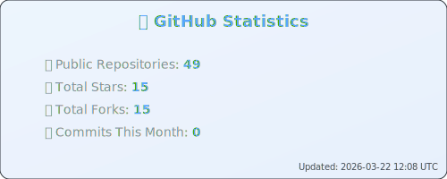
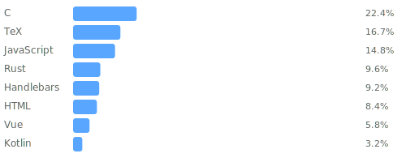

    

    
    
    

---

## 🚀 About me

Curious, eager to learn and committed - describe me best. At the moment, sustainability, continuous integration and agility keep me most busy. I am a web developer with particular strengths in TYPO3, Javascript, SCSS and most recently PHP. Due to my studies, requirements gathering, user stories, project management and UX and UI design are not foreign words to me - on the contrary - my passion and mission can be found here as well.

## 📘 My Resume

My resume is available in German and English. Click the labels below to download the current one.
They are built with LaTeX.

    

## 🛠️ My Skills

My current tech-stack

#### Frontend Tools

#### Backend Tools

#### Local Environment

#### Deployment

#### Programming Languages

#### Frameworks

#### Database

#### Linting

#### Hosting, Prototyping and Deployment

#### Graphical Design

#### EDV and Writing

#### Modelling and project management

## ✨ Future Skills to acquire:

1. 
2. 
3. 

## ⚙️ My Gear

#### IDE's I use

#### Terminal Emulator

---

<!-- DYNAMIC_CONTENT_START -->

## 📈 Dynamic Statistics

### 💻 Language Usage This Year

### 📊 Contribution Metrics

### 🏆 GitHub Trophies

### 💡 Dev Quote of the Update

*"Make it work, make it right, make it fast." — Kent Beck*

---

**🌅 Morning coding session** | **🤖 Last auto-update:** January 04, 2026 at 08:06 UTC

<!-- DYNAMIC_CONTENT_END -->

## 🌍 My open-source Projects

- [GitHub Action for Deployment on Virtual Hosts](https://github.com/mai-space/action-sshpass-rsync)
- [JetBrains Plugin for Commit Message Template with TYPO3 Guidelines](https://github.com/mai-space/plugin-phpstorm-typo3-commit-template)
- [CLI Tool Cowsay Addition](https://github.com/mai-space/cli-tool-alpacasay)
- [JabRef Dracula Theme](https://github.com/mai-space/theme-jabref-dracula)

## 🎧 Music I have recently listened to

## 🔗 Let's get in touch

